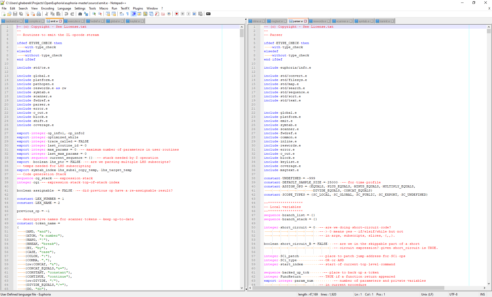
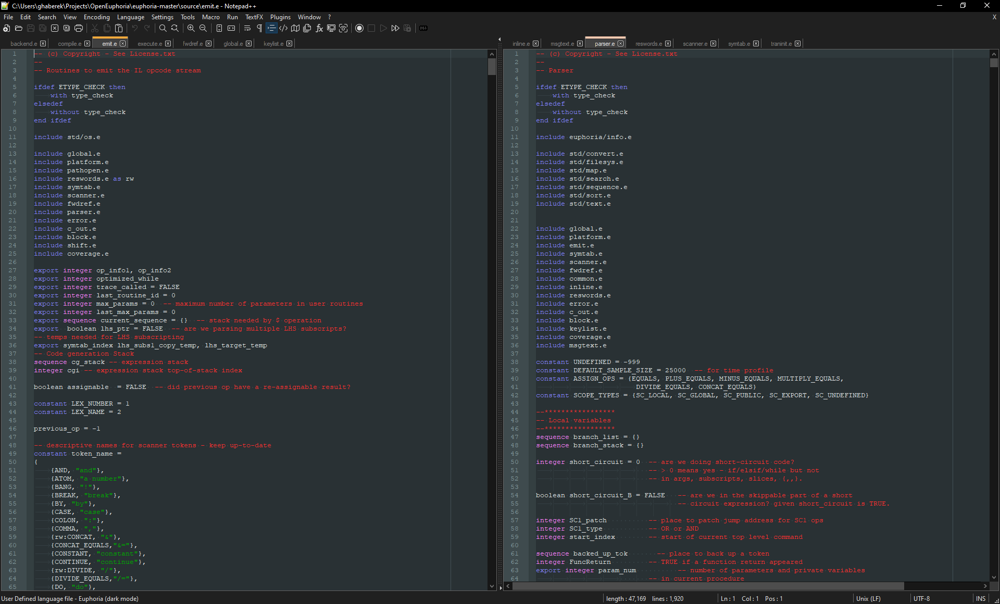

# Notepad++

Euphoria syntax highlighting for Notepad++.  
Created by Greg Haberek <ghaberek@gmail.com>.

## Overview

We have included two [User Defined Language](https://npp-user-manual.org/docs/user-defined-language-system/) files:

  - [euphoria.udl.xml](euphoria.udl.xml) *(light mode)*
  - [euphoria_DM.udl.xml](euphoria_DM.udl.xml) *(**dark mode**)*

## Installation

  1. Download one or more of the XML files above.
  2. Click **Language** > **User-Defined Language** > **Define your language...**
  2. Click **Import...** and select the XML files and then click **Open**.
  4. The new options will show up at the bottom of your **Language** menu.

## Dark mode

  - You will need Notepad++ 8.0.0 or later to enable [Dark mode](https://notepad-plus-plus.org/news/v8-dark-mode/).
  - To enable dark mode, click **Settings** > **Preferences** > **Dark mode** > **Enable dark mode**.
  - You can install both files and the dark mode version will be selected automatically.

## Notes

  - These files were built using Notepad++ 8.2.1; they may not work correctly on older versions.

## Examples

